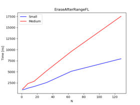
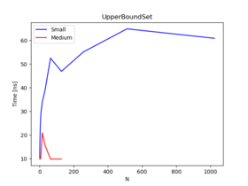

# 05 STL BENCHMARKS

_Used hardware:_
* _Intel Core i5-4200M: 4 X 2494.24 MHz CPU s_
* _8 GB DDR3 RAM_
* _HDD_

## Report

1. Missing operators and hash function
    1. Less-then operator compares every element of our tables,checking which element is smaller 
    in lexicographical order. In N-dimensional data such as our table, it should compare 
    corresponding elements of the tables until it meets the smaller element in first table.
    I use For loop, comparing individual elements. This way is faster than use function 
    std::lexicographical_compare. You can see it by comparing the benchmark results: 
    [For loop method](output/comparisonBenchmark) and 
    [std::lexicographical_compare](output/comparisonBenchmarkSTDFunction).
    
    2. In equality operator i use the same For loop method until two corresponding elements are not equal.
    std::equal function is slower. Check results: [For loop method](output/equalityBenchmark) and
    [std::equal](output/equalityBenchmarkSTDFunction).
    
    3. A hash function is used to map data and give a special value which will identify that data.
    It is deterministic, universal, efficient.
    
    4. I sum individual elements of the table multiplied by their index in the array.
    Thanks to this we get a relatively unique number, describing our data.

2. Unit test for operators and hash functions
    
    1. I prepare special tests to validate my implementation of operators and hash function. 
    I initialize objects manually with known data sand then check return value.
    
    2. I think we should initialize tested objects manually with known data, because we can predict final result
    of the test. But we should check several cases to make sure, that code works properly.
    
3. Benchmarks for operators and hash functions

    1. Create void function and initialize objects to test. Inside for loop is code we want to test. 
    If necessary, objects are filled with data with each iteration.
    We make test executable by adding an expression BENCHMARK(<test_name>). 
    
    2. Yes, there are consequences. It use implemented functions to sort the data. So, when our implementation
    is slow, all operations in sequential containers are slower.
    
    3. Going through the container and finding the element then, takes more time.
    
    4. Unordered associative containers are not sorted, but organized into buckets. Which bucket an element 
    is placed depends on the hash of its value. When our implementation is slow, it have slower access
    to individual elements. The same situation applies to equality operator, because to find individual
    element in container it search an exact bucket the element was placed into. Every operation should be done
    as soon as possible. 

    5. It's faster to use own implemented function for loop, than stl::lexicographical_compare and 
    stl::equal. You can see a difference in output Benchmark files e.g. [comparison](output/comparisonBenchmark),
    [equality](output/equalityBenchmark) and [comparisonSTD](output/comparisonBenchmarkSTDFunction), 
    [equality](output/equalityBenchmarkSTDFunction). Using the STL function we have 1% RMS, but the average
    execution of comparison time and execution of equality operation time is much bigger than in my implementation.
    
        As the amount of data increases, the time it takes to complete the operation increases too. You can see this
    difference mainly in hash function. For less-than and equality operation i initialize objects with random
    data, so the probability of occurrence of different elements in compared tables is similar. For this reason,
    times do not differ so significantly in Medium and Large.
    
    6. Using random data we are closer to the correct test result, because data is not in the order we set, which
    can be e.g. easy to sort. Repeating the test on random data, we can see the real average operation time.
    
4. Create benchmarks for assigned containers/methods using Small type and Debug build

    1. It is similar to the previous call, but we also add during a call information in what range we want to
    test complexity. 
    
    3. Not in every benchmark. This is because my implementation is slower or i gave too small range of test.
    
    4. We must always have the same amount of data to the right range. So we need to fill the array, or delete it,
    with each iteration. To add or delete data I use pause/resume timing method. Thanks to that, the time of these
    operations is not included in the benchmarks.
        The baseline method is faster in calculations. E.G. We check the time of adding the element and then time adding and 
    removing. We don't use pause/resume. We need to subtract these two results from each other, thanks to that we will 
    get the remove time.
    
5. Appropriate escape functions to prevent optimization and run benchmarks in Release build
    
    2. DoNotOptimize() and ClobberMemory() cause, that data is not optimized and no objects are skipped.
    
    3. Yes, in Release mode time of individual operations is shorter. In some cases, complexity also decreases.

6. Differences in time and complexity

    1. The differences are noticeable. Usually when we have more data and operation must check all data, it takes longer, 
    what you can see in the charts. in some cases, there are also changes in complexity. If it happens, less complexity
    usually occurs in bigger data size
    
    2. The program needs to check more data, so it will take him more time. Operators implementation also have impact. 
    next thing is the range in which i run benchmarks. When the ranges were too small, it could distort the results a little.
    
    
4.2 Plots Debug Small

Forward List

 

Set

Unordered multiset

Plots

6.1 Forward List Release

6.2 Set Release

6.3 Unordered Multiset Release

